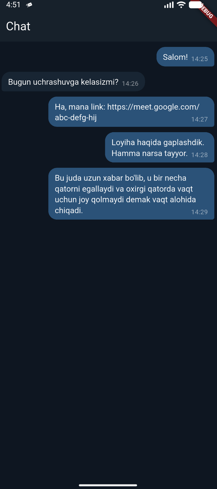

# telegram_message_bubble_demo

Telegramdagi messageboxni yasashga harakat qilganimda ko'p qiynaldim. U yerda bir nechta qadamlar qoyilmaqom tarzda
bajarilgan edi.

- Agar xabar qisqa bo'lsa xabar va vaqt bir qatorda 
- Agar xabar uzun bo'lib qatorda joy qolmasa vaqt alohida qatorda
- Agar xabar uzun bo'lib oxirgi qatorda vaqt uchun joy qolsa vaqt o'sha oxirgi qatorda
- Vaqt doim o'ng taraf qatorning oxirida va asosiy kontentdan biroz pastroqda

Ushbu shartni qanoatlantiradigan holatga olib kelish oson bo'lmadi.

Foydalaning

## Screenshots

